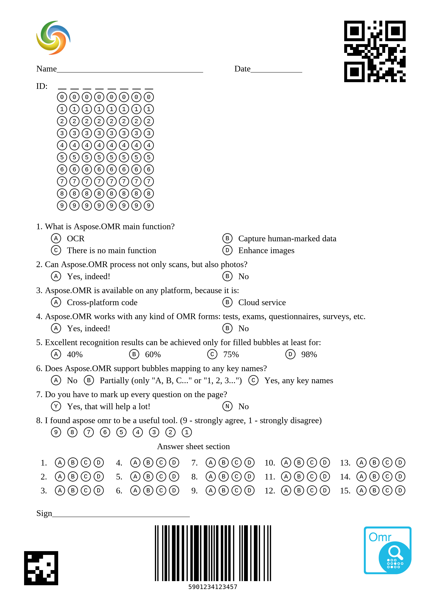

# Aspose.OMR for Cloud

[Aspose.OMR for Cloud](https://products.aspose.cloud/omr/cloud) is a REST API that helps you to perform optical mark recognition in the cloud. We provide a series of [SDKs](https://github.com/aspose-omr-cloud). Along with that, you can get [binaries](https://github.com/aspose-omr-cloud/aspose-omr-cloud-dotnet/releases) to start working immediately and recognize various OMR forms.

Developers can embed [optical recognition](https://en.wikipedia.org/wiki/Optical_mark_recognition) in any type of application to extract data from images of tests, exams, questionnaires, surveys, etc. In the repository you can find examples on how to start using [Aspose.OMR API](https://docs.aspose.cloud/display/omrcloud/OMR+API+Specification) in your project.

## Contents

The repository contains sample applications that demonstrate how to perform common OMR with Aspose.OMR API.

  

Directory | Description
--------- | -----------
[Aspose.OMR.Client](Aspose.OMR.Client)  | An open source .NET application with GUI that helps you work with OMR templates and perform OMR operations.
[Aspose.OMR-Cloud.SDK](SDK)  |Aspose.OMR Cloud SDK provides functionality for using Aspose.OMR for Cloud API to recognize optical marks from sheet images in the cloud. It also contains demonstration console project.
[TestData](TestData) | Sample images and templates that demonstrate how OMR works on real data.
[aspose-omr-cloud-demo-data](aspose-omr-cloud-demo-data) | Submodule with data required to run  [Aspose.OMR.Demo](https://github.com/aspose-omr-cloud/aspose-omr-cloud-dotnet/tree/master/SDK/Aspose.OMR.Demo) 

## Quickstart

You can perform tasks out of the box without writing a single line of code. That requires two simple steps:

### 1. Receive Cloud Keys
Aspose.Cloud credentials are required to use Aspose.OMR for Cloud API. You can acquire App SID and App Key by registrating at [Aspose Cloud Dashboard](https://dashboard.aspose.cloud/). It will take only a couple of minutes.

### 2. Get OMR Client
Check [releases](https://github.com/aspose-omr-cloud/aspose-omr-cloud-dotnet/releases) section and download MSI package that installs OMR.Client. Using this GUI application you can create OMR templates, correct or update existing OMR templates and perform optical mark recognition using Aspose.OMR.Cloud engine. 

More info and documentation can be found at: [Client documentation](https://docs.aspose.cloud/display/omrcloud/Aspose.OMR.Client+Application)

Get familiar with OMR Client with short Quickstart video:

## Using OMR Cloud API in your projects
It is quite easy to use OMR in your projects. All you need to do is:

1. Get [Aspose Cloud](https://dashboard.aspose.cloud/) credentials - App Key and App Sid.
2. Install Aspose.OMR Cloud SDK via [nuget](https://www.nuget.org/packages/Aspose.OMR-Cloud/).
3. Use OMR.Client to create templates or use one from [our examples](https://github.com/aspose-omr-cloud/aspose-omr-cloud-dotnet/tree/master/TestData).
4. Start using [OMR functions](https://docs.aspose.cloud/display/omrcloud/OMR+API+Specification) and get recognition results.

Check [Aspose.OMR.Demo](https://github.com/aspose-omr-cloud/aspose-omr-cloud-dotnet/tree/master/SDK/Aspose.OMR.Demo) solution for a simple demonstration of how OMR functions can be called from your code.

## How does it work?

Simply prepare your questions with our simple markup language. Below you can see [survey example](TestData/AsposeTestBarcodes.txt).

## What do you get?

You’ll get a nice and sharp survey ready to print!

## What is next?

Simply make mobile snapshots or scan filled forms, upload them into OMR.Client or call API and you have the results!

 

## Roadmap
In the upcoming releases, we are set to implement a number of new features:

 - [X] Reduce your expenses by preprocessing and compressing your images
 - [X] Simplify OMR form preparation by introducing an easy markup language. For example, to get the particular survey form ready you only need to provide questions and answers 
 - [X] Support PDF
 - [X] Support barcodes and QR codes generation and recognition
 - [X] Support [Clip Areas](https://docs.aspose.cloud/display/omrcloud/Clip+areas+of+interest)
 - [X] [Grade OMR results](https://docs.aspose.cloud/display/omrcloud/Answers+Grading) based on rules
 - [X] OMR.Client usability improvements: more hints&tips, built-in printer and scanner support
 - [ ] Support diverse interviewee’s marks (ticks, crosses, corrections, etc) on various forms with the use of neural networks
 - [ ] Support multipage templates
 - [ ] Handprinted text recognition
 

## Resources

+ **Website:** [www.aspose.com](https://www.aspose.com/)
+ **Product Home:** [Aspose.OMR for Cloud](https://products.aspose.cloud/omr/net)
+ **Documentation:** [Aspose.OMR for Cloud Documentation](https://docs.aspose.cloud/display/omrcloud/Home)
+ **Cloud Dashboard:** [Aspose Cloud](https://dashboard.aspose.cloud/)
+ **Forum:** [Aspose.OMR for Cloud Forum](https://forum.aspose.cloud/c/omr)
+ **Blog:** [Aspose.OMR for Cloud Blog](https://blog.aspose.cloud/category/aspose-products/aspose.omr-product-family/)
+ **Nuget:** [Aspose.OMR-Cloud](https://www.nuget.org/packages/Aspose.OMR-Cloud/)
+ **OMR Client Releases:** [Github Releases](https://github.com/aspose-omr-cloud/aspose-omr-cloud-dotnet/releases)
+ **OMR Client Documentation:** [Aspose.OMR.Client Application](https://docs.aspose.cloud/display/omrcloud/Aspose.OMR.Client+Application)
